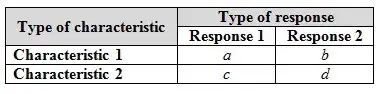
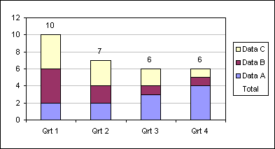
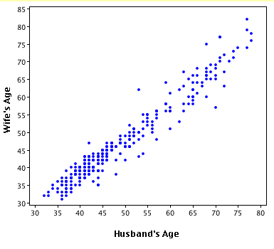

# UNDERSTANDING THE DATA : Things you might miss!!
Data exploration, the right way

Usually we don’t focus on the data exploration part as a beginner, however, understanding the data just by exploration and running statistical tests on it could provide great insights about it.

The following article deals with the measures of statistical analysis for univarite( analysis on one variable) and bivariate(analysis between two variable). You can easily find codes for these in the language you use for doing exploration.

## UNIVARIATE ANALYSIS :

There are two kind of variables you will come across with, that are :

- Categorical( the ones having discrete values, eg. outcome of a rolling dice, variables showing yes/no type attribute etc.)

- Continuous( the ones taking continuous values, eg. age of a person, weight of the vegetables etc.)

Categorical : You could simply use frequency tables or Bar plot to know about the behavior.

Continuous : To understand more about a continuous variable you could use measures of central tendencies(mean, median and mode). You can also use Inter quartile range for outlier identification.

## BIVARIATE ANALYSIS :

Here we can come across following cases:

- Categorical & Categorical
- Categorical & Continuous
- Continuous and Continuous

I would not go in very much detail of the things used here in this article. The detailed description will be given in the articles following this one.

Categorical & Categorical:

Following are the things we could use for analyzing two categorical variables:

- A two way table of counts, count percent, contingency table.
- Stacked column charts for the two categorical variables.
- Chi-square test of independence.

<figure>

<figcaption align = "center">two way table of counts</figcaption>
</figure>

<figure>

<figcaption align = "center">stacked charts</figcaption>
</figure>

### Categorical & Continuous :

Following are the things we could use for analyzing categorical and continuous variables :

- Box plots for each level of categorical variables. Be careful about choosing these levels as if there is a small number in a particular level, the results would be insignificant.

- Z-Test

- T-test

- Anova (analysis of variance)

Continuous & Continuous :

Following are the things we could use for analyzing two continuous variables :

- Scatter plots between the two variables
- Correlation between the variables
<figure>

<figcaption align = "center">scatter plot</figcaption>
</figure>
